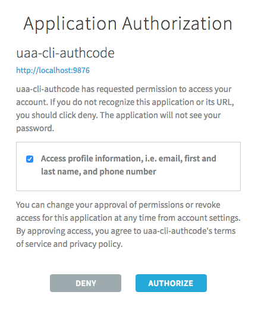
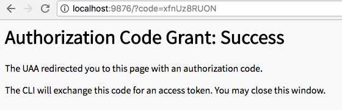
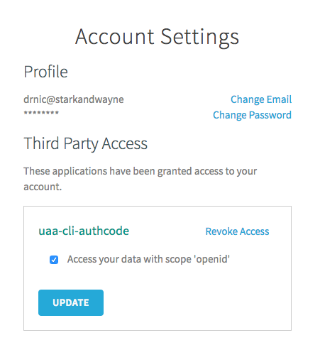

# Authenticating User via Web UI

The risk of a user providing their username/password to a UAA third-party client application is that a sneaky client application might store the raw username/password and reuse them later without the user's permission.

This risk can be avoided by never giving the user's credentials to third-party applications, rather only giving them directly to the UAA web UI. That is, the third-party client application delgates the login process to the UAA user interface, and in return receives a authorization token that the application can use to make subsequent API requests on behalf of the user.

First, register a new UAA client that is designed to allow the `uaa` to be used by normal UAA users.

```text
uaa-deployment auth-client
uaa create-client uaa-cli-authcode -s uaa-cli-authcode \
  --authorized_grant_types authorization_code,refresh_token \
  --redirect_uri http://localhost:9876 \
  --scope openid
```

Typically each third-party application in the world will have its own registered UAA client. They become synomynous. If we talk about the application, we implicitly can refer to its UAA client, and vice versa.

Some examples:

* The Cloud Foundry CLI `cf` primarily interacts with a target UAA via a client `cf` ([UAA configuration](https://github.com/cloudfoundry/cf-deployment/blob/master/cf-deployment.yml#L415-L423))
* The BOSH CLI `bosh` interacts with a target UAA via a client `bosh_cli` ([UAA configuration](https://github.com/cloudfoundry/bosh-deployment/blob/master/uaa.yml#L51-L59), [`bosh` cli configuration](https://github.com/cloudfoundry/bosh-cli/blob/master/cmd/session.go#L75-L76))

A third-party application might use multiple UAA clients - each with different scopes of authority. For example, the `cf` CLI can use `cloud_controller_username_lookup` to convert UAA user IDs back into readable names (see [definition of client](https://github.com/cloudfoundry/cf-deployment/blob/38b304405764e1307f606d02856e4366b2337cbd/cf-deployment.yml#L423-L426)).

The `uaa` third-party UAA client application is special - it can take on the behavior/authorities of any UAA client. Hence, each of its authentication/authorization commands require use to pass the client/secret.

Next, the user can authorize the `uaa` without providing it their username/password:

```text
uaa get-authcode-token uaa-cli-authcode -s uaa-cli-authcode --port 9876
```

The output will look similar to:

```text
Launching browser window to https://drnic-uaa.starkandwayne.com:8443/oauth/authorize?client_id=uaa-cli-authcode&redirect_uri=http%3A%2F%2Flocalhost%3A9876&response_type=code where the user should login and grant approvals
Starting local HTTP server on port 9876
Waiting for authorization redirect from UAA...
```

The user's web browser will be redirected to the UAA UI. If they have not already authenticated (logged in) then they will be prompted to do that.

Next, they will be asked to grant authorization to the `uaa` CLI (via its `uaa-cli-authcode` UAA client):



The UAA UI explains to the user the scope of permissions that the `uaa` CLI is requesting. When we ran `uaa create-client uaa-cli-authcode` to create the UAA client, we only requested `--scope openid`. That is, the `uaa` CLI only wants the abilities of the `openid` scope. The UAA UI now confirms that this means in plain english: "Access profile information, i.e. email, first and last name, and phone number".

After clicking "Authorize" the browser changes to:



Back in the terminal, the `uaa get-authcode-token` command has now completed:

```text
Local server received request to GET /?code=xfnUz8RUON
Calling UAA /oauth/token to exchange code xfnUz8RUON for an access token
Stopping local HTTP server on port 9876
Access token added to active context.
```

If we visit the "Account Settings" in the UAA web UI we can see that `drnic` has a record of the new third-party application that has been previously authorized. It also documents that the application only has permission to use UAA API operations that only require the `openid` scope.



Running `uaa get-authcode-token` again will automatically authenticate the user via the browser:

```text
uaa get-authcode-token uaa-cli-authcode -s uaa-cli-authcode --port 9876
```

The `uaa` CLI is now acting on behalf of a user.

The `openid` scope allows the UAA API calls for:

```text
uaa userinfo
```

But `drnic` cannot use `uaa` CLI to perform other API requests that have not been permitted to `drnic`, that `uaa` has requested from `drnic`, or that `drnic` has not permitted to `uaa` application:

```text
$ uaa list-clients --verbose
{"error":"insufficient_scope","error_description":"Insufficient scope for this resource","scope":"uaa.admin clients.read clients.admin zones.uaa.admin"}

$ uaa list-users --verbose
{"error":"insufficient_scope","error_description":"Insufficient scope for this resource","scope":"uaa.admin scim.read zones.uaa.admin"}
$ uaa get-user drnic --verbose
{"error":"insufficient_scope","error_description":"Insufficient scope for this resource","scope":"uaa.admin scim.read zones.uaa.admin"}

$ uaa create-user foo --email foo@bar.com --givenName Foo --familyName Bar --verbose
{"error":"insufficient_scope","error_description":"Insufficient scope for this resource","scope":"uaa.admin scim.write scim.create zones.uaa.admin"}
```
