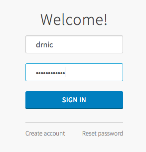
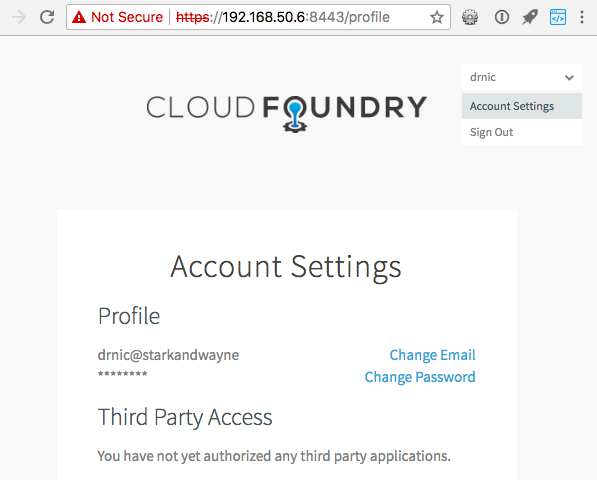

```
uaa create-user drnic \
  --email drnic@starkandwayne \
  --givenName "Dr Nic" \
  --familyName "Williams" \
  --password drnic_secret
```

Once created, we can lookup the user with their username:

```
uaa get-user drnic
```

The JSON output might be similar to:

```json
{
  "id": "87fde4a5-17f3-4667-a5e2-fff62220c73e",
  "meta": {
    "created": "2018-06-22T09:27:10.655Z",
    "lastModified": "2018-06-22T09:27:10.655Z"
  },
  "userName": "drnic",
  "name": {
    "familyName": "Williams",
    "givenName": "Dr Nic"
  },
  "emails": [
    {
      "value": "drnic@starkandwayne",
      "primary": false
    }
  ],
  "groups": [
    {
      "value": "5a201c79-3265-46a8-873d-8631facdb2a1",
      "display": "user_attributes",
      "type": "DIRECT"
    },
    {
      "value": "b07d8fda-aaba-4f3e-9f5c-dca9f7c99e9f",
      "display": "roles",
      "type": "DIRECT"
    },
```

Visit the UAA web UI, logout from `admin` user, and login as `drnic`:



In the top right corner, select "Account Settings" and note that the new user has not yet granted any third-party client applications permission to access their UAA account:



As mentioned before, when the `drnic` user logs into the UAA web site it is directly interacting with the UAA itself. The login process is `drnic`'s way of identifying who they believe they are (username: `drnic`) and proving that they are indeed `drnic` via their password (this is called authentication).
