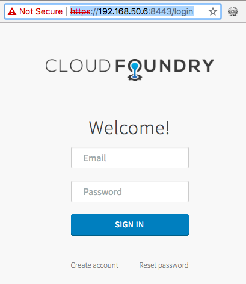
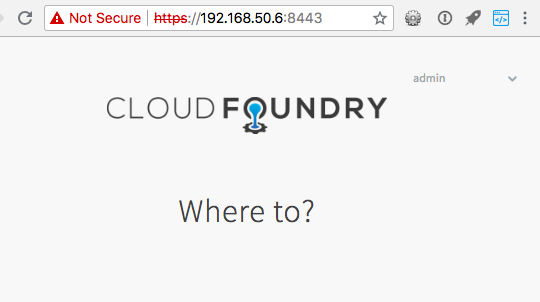

# Deploy UAA

The [Ultimate Guide to UAA](/) book includes an accompanying free tool to deploy a production-grade UAA to your local machine or any cloud infrastructure.

Your UAA will have generated certificates, randomized passwords, and its PostgreSQL-backed data will be stored on a persistent disk volume on your target cloud infrastructure.

The [`uaa-deployment` CLI](https://github.com/starkandwayne/uaa-deployment) tool is built for Linux/OSX/Bash environments.

To download and prepare the `uaa-deployment` project using `git`:

```text
git clone https://github.com/starkandwayne/uaa-deployment
cd uaa-deployment
source .envrc
```

To deploy or upgrade a UAA server to your local machine via VirtualBox:

```text
uaa-deployment up
```

Once our UAA is running we can view the target URL and some admin-level authentication:

```text
uaa-deployment info
```

The output might look like:

```text
UAA:
  url: https://192.168.50.6:8443
  client: uaa_admin
  client_secret: nnb2tbev0j82gxdz65xc
  username: admin
  password: 2rbaswzllkuy51ymzahz
```

Visit the URL and you will be redirected to the `/login` page:



Try to login with both pairs of credentials - client/client_secret, and username/password.

You will discover that you cannot authenticate with client/client_secret. These are not user credentials.

Rather they are credentials for an application to talk to the UAA API - either on behalf of itself (say, to register new UAA users or new UAA clients), or on behalf of a UAA user (say, to ask for the user's personal information, or their authorized permissions within the organization).

Succesfully logging in with the `admin` username/password will look like:



You'll see a corporate logo (the default is "Cloud Foundry"), the title "Where to?", and .... a void of emptiness. This homepage of the UAA can be filled with "tiles" - icons/names for your internal corporate applications that users can possible use. We will revisit this later.

## Upgrading UAA

Your UAA, including Java & Tomcat & PostgreSQL, is running on a single VM (via VirtualBox if you run `uaa-deployment up` without the `--cpi` flag). Over time new versions of the UAA or PostgreSQL will be available.

To upgrade:

```text
git pull
uaa-deployment up
```

## Destroy UAA

Later when you want to destroy your UAA VM and associated persistent disk:

```text
uaa-deployment down
```