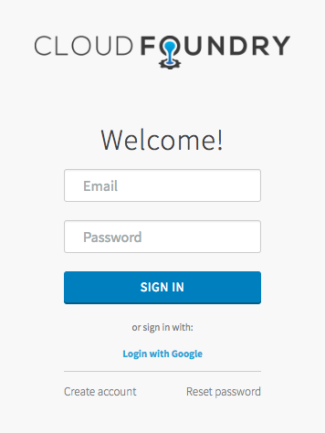
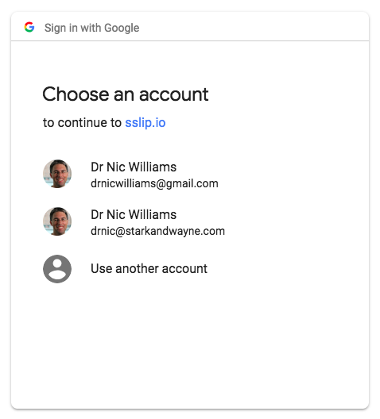

# Integrating UAA and Google Apps

https://github.com/cloudfoundry/uaa/blob/master/docs/google-oidc-provider.md

https://developers.google.com/identity/protocols/OAuth2


```text
mkdir -p operators
cp ops-examples/google-oidc/7-google-oidc-provider.yml operators/
```

In `vars.yml` add the following two lines:

```yaml
google_client:
google_client_secret:
```

Google requires that we use a domain name for our client, so the above changes also modify the URL. This means we need to regenerate the SSL certificates when we deploy.

```text
rm state/creds.yml
uaa-deployment up
```

## Login with Google

To get your new UAA URL:

```text
uaa-deployment info
```

If it was https://192.168.50.6:8443/ before then it will now be https://192.168.50.6.sslip.io:8443/



Click on "Login with Google" link. You will be redirected to choose a Google account and authorize the UAA. When you return to the UAA home page your email will be your UAA user.



## Google User in UAA

To view your new user, first update your local environment variables, login as `uaa_admin` client, and run `uaa list-users`:

```text
source <(bin/uaa-deployment env)
uaa-deployment auth-client
uaa list-users | jq -r ".[-1]"
```

The output might look similar to:

```json
{
  "id": "822267e9-c1a9-474f-b5b1-47f57f9e4a40",
  "externalId": "110256939637129558010",
  "meta": {
    "created": "2018-07-05T05:14:11.189Z",
    "lastModified": "2018-07-05T05:14:11.189Z"
  },
  "userName": "drnic@starkandwayne.com",
  "name": {},
  "emails": [
    {
      "value": "drnic@starkandwayne.com",
      "primary": false
    }
  ],
  "groups": [
    ...
    {
      "value": "9b838b54-3ae0-4f27-882f-ec39c928493a",
      "display": "openid",
      "type": "DIRECT"
    },
    ...
  ],
  "active": true,
  "verified": true,
  "origin": "google",
  "zoneId": "uaa",
  "passwordLastModified": "2018-07-05T05:14:11.000Z",
  "lastLogonTime": 1530767651229,
  "schemas": [
    "urn:scim:schemas:core:1.0"
  ]
}
```

Of note is `"origin": "google"` which indicates that the user originated from Google. Previously our `uaa create-user` users had `"origin": "uaa"`.

## Restrict Google Apps Users by Email Domains

In the example above I chose my `drnic@starkandwayne.com` Google account, but I also could have chosen my `drnicwilliams@gmail.com` account and the UAA would have happily created a new UAA user for it. Let's say that's not what I want. Let's say you can only "Login with Google" with a starkandwayne.com email account.

Copy the `ops-examples/google-oidc/8-google-apps-restrict-domain.yml` operator file into `operators/` folder:

```text
cp ops-examples/google-oidc/8-google-apps-restrict-domain.yml operators/8-google-apps-restrict-domain.yml
```

Add the following line to your `vars.yml` file to specify your own Google Apps email domain:

```yaml
google_restrict_domain: starkandwayne.com
```

Actually, you can create your own file like `operators/8-google-apps-restrict-domain.yml` to support multiple domains. The `uaa` job has a property `login.oauth.providers.google.emailDomain` that is an array of domains.

Run the `uaa-deployment up` command again to update your UAA configuration:

```text
uaa-deployment up
```
