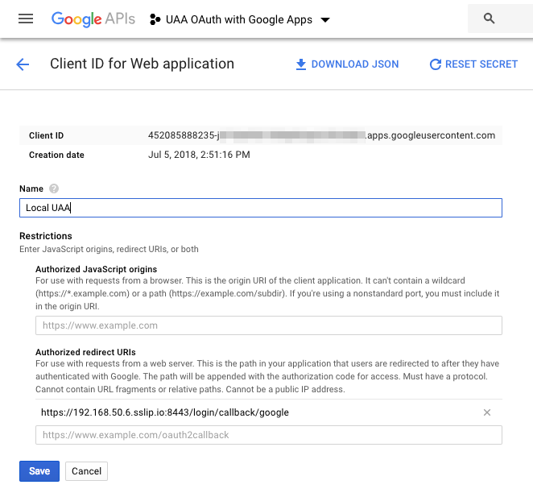

# Integrating UAA and Google Apps

https://github.com/cloudfoundry/uaa/blob/master/docs/google-oidc-provider.md

https://developers.google.com/identity/protocols/OAuth2



```text
mkdir -p operators
cat > operators/8-google-apps-oidc-provider.yml <<YAML
- type: replace
  path: /instance_groups/name=bosh/jobs/name=uaa/properties/uaa/url
  value: "https://((internal_ip)).sslip.io:8443"

- type: replace
  path: /variables/name=mbus_bootstrap_ssl/options/alternative_names/-
  value: "https://((internal_ip)).sslip.io:8443"

- type: replace
  path: /variables/name=uaa_ssl/options/alternative_names/-
  value: "https://((internal_ip)).sslip.io:8443"

- type: replace
  path: /variables/name=uaa_service_provider_ssl/options/alternative_names/-
  value: "https://((internal_ip)).sslip.io:8443"

- type: replace
  path: /instance_groups/name=bosh/jobs/name=uaa/properties/login/oauth?/providers/google
  value:
    type: oidc1.0
    authUrl: https://accounts.google.com/o/oauth2/v2/auth
    tokenUrl: https://www.googleapis.com/oauth2/v4/token
    tokenKeyUrl: https://www.googleapis.com/oauth2/v3/certs
    issuer: https://accounts.google.com
    redirectUrl: "https://((internal_ip)):8443"
    scopes:
      - openid
      - email
    linkText: Login with Google
    showLinkText: true
    addShadowUserOnLogin: true
    relyingPartyId: ((google_client))
    relyingPartySecret: ((google_client_secret))
    skipSslValidation: false
    attributeMappings:
      user_name: email
YAML
```

Google requires that we use a domain name for our client, so the above changes also modify the URL. This means we need to regenerate the SSL certificates when we deploy.

```text
rm state/creds.yml
uaa-deployment up
```

In `vars.yml` add the following two lines:

```yaml
google_client:
google_client_secret:
```