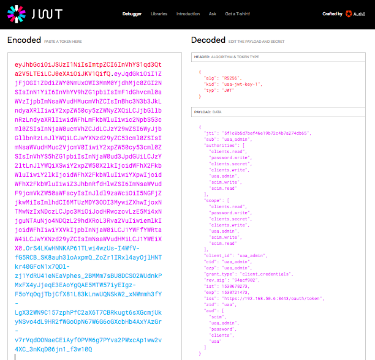
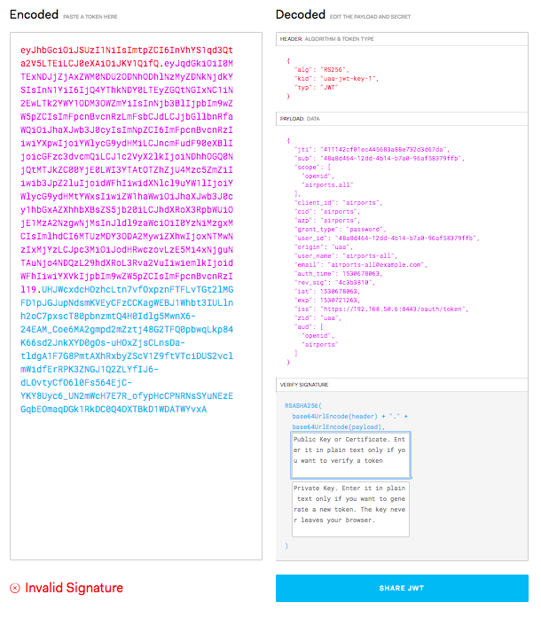
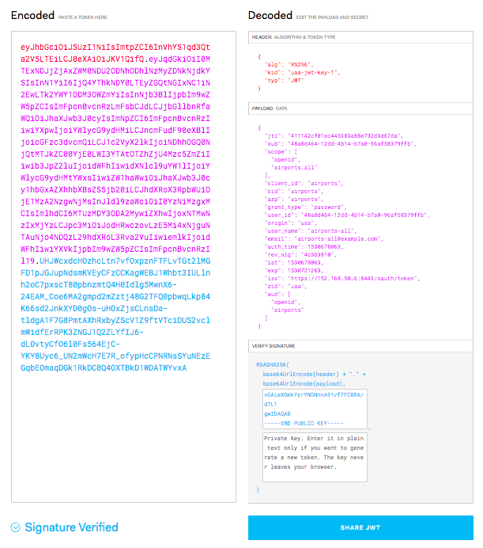

# JSON Web Token / JWT

The access token is not a random sequence of numbers and letters. Rather it is two encoded JSON objects. The encoded JSON objects are called a JSON Web Token, or JWT.

We can inspect the contents of any access token using:

```text
uaa-deployment auth-client
uaa context --access_token
```

Copy and paste this string into the educational site [jwt.io](https://jwt.io) inside the left-hand side Encoded text area:



The two decoded JSON objects are displayed on the right hand side.

* Header - describes the encoding algorithm for the payload JSON and the signing key label
* Payload - the metadata associated with the authenticated user/client

The client credentials for client `uaa_admin` example above includes the list of `authorities` and `scopes`. The UAA API or other UAA client applications can uses the values in these lists to enable or restrict functionality.

The decoded access token of a password-grant user looks similar. Copy and paste a password-granted user's access token into [jwt.io](https://jwt.io):

```text
uaa get-password-token airports -s airports -u airports-all -p airports-all
uaa context --access_token
```


## Verify JWT signature

Since a JWT string is easily encoded and decoded by anyone it is important to ensure that we trust that our JWT access tokens were definitely provided by our own UAA, not someone else we don't trust.





## Refresh Access Token

`jtw` vs `opaque` methods

## Rotating JWT keys

TODO: Waiting on Slack discussion on how UAA team expects ppl to curate their keys overtime via BOSH.

The UAA is designed to encourage operators to routinely rotate thru JWT signing keys. If it is possible for a signing key to be guessed or hacked, then regularly rotating the signing keys reduces the time that a hacker has to perform the malicious activity before their hacked keys are made invalid.

Adam Eijdenberg:

> Google I think rotate theirs approx once a day, and their equivalent to `/token_keys` seems to always return 2 values: https://www.googleapis.com/oauth2/v3/certs

The UAA created by `uaa-deployment up` starts with one JWT signing key:

```text
uaa token-keys
```

To add an additional key and make it the new primary key we need to create `operators/8-jwt-key-2.yml`:

```text
mkdir -p operators
cat > operators/8-jwt-key-2.yml <<-YAML
- type: replace
  path: /instance_groups/name=bosh/jobs/name=uaa/properties/uaa/jwt/policy/active_key_id
  value: uaa-jwt-key-2

- type: replace
  path: /instance_groups/name=bosh/jobs/name=uaa/properties/uaa/jwt/policy/keys/uaa-jwt-key-2
  value:
    signingKey: ((uaa_jwt_signing_key_2.private_key))

- type: replace
  path: /variables/-
  value:
    name: uaa_jwt_signing_key_2
    type: rsa
YAML
```

And now re-deploy your UAA:

```text
uaa-deployment up
```

The `/token_keys` endpoint will now return both keys - the old and the new. To view them:

```text
uaa token-keys
```

The output might be similar to:

```json
[
  {
    "kty": "RSA",
    "e": "AQAB",
    "use": "sig",
    "kid": "uaa-jwt-key-1",
    "alg": "RS256",
    "value": "-----BEGIN PUBLIC KEY-----\nMIIBIjANBgkqhkiG9w0BAQEFAAOCAQ8AMIIBCgKCAQEA0tWt2QL+tJDardFZPpGK\nHjY19FJeuepWE8yoRqFyQslmVTB+uJWRbM3SzTT+IFY2QqS9Jbg2VPU0+zLTlPf+\ng3oIGD/lCqlKwIa9lIF9tQWivCz08dL4PIsFTtPU9EhRtm0CzKx1pZWwzCuGT/vv\ns/9LNh5BhJyEt/QSHPHnl1bN6SarvK5RW5qq827ExWsXsdx2zqYghMnlfWqSD3L/\nHcwS+JBUAgG9swYkjg1djxlU8IBoeV1YR65Cs3E/pgxtoap7mLlEx+HZYEM0Qtfm\nfWbm+iTDSa/YXu8pUQcP7QDEzR06EHhgxKwT7NKYf75quTYjeeD7+cIRbKpGUTTj\nJwIDAQAB\n-----END PUBLIC KEY-----",
    "n": "ANLVrdkC_rSQ2q3RWT6Rih42NfRSXrnqVhPMqEahckLJZlUwfriVkWzN0s00_iBWNkKkvSW4NlT1NPsy05T3_oN6CBg_5QqpSsCGvZSBfbUForws9PHS-DyLBU7T1PRIUbZtAsysdaWVsMwrhk_777P_SzYeQYSchLf0Ehzx55dWzekmq7yuUVuaqvNuxMVrF7Hcds6mIITJ5X1qkg9y_x3MEviQVAIBvbMGJI4NXY8ZVPCAaHldWEeuQrNxP6YMbaGqe5i5RMfh2WBDNELX5n1m5vokw0mv2F7vKVEHD-0AxM0dOhB4YMSsE-zSmH--ark2I3ng-_nCEWyqRlE04yc"
  },
  {
    "kty": "RSA",
    "e": "AQAB",
    "use": "sig",
    "kid": "uaa-jwt-key-2",
    "alg": "RS256",
    "value": "-----BEGIN PUBLIC KEY-----\nMIIBIjANBgkqhkiG9w0BAQEFAAOCAQ8AMIIBCgKCAQEAyXy/9N4Znj+iAJeAO2IO\ncslSWjfv6JdPiDKTNQlgjnMw0ALmNMe+8qPqbVnxkN/djoS8Aqy48+6ghvs5wwR0\nXAMWZ4p9YYM5D1UJPA7DdSr/wcZeth+ZgQ/fdfxnhaJBipXVIRuDvYA/1ffCY3Nl\nAcyUfPgqFVr1N18yjBr3PvuOmqRQSCH+U8/Jq2fXbOtzemEBGcduYqX/uS4ao12i\n/gb5Bx1TJBJpBkLpknQ6wj0x4ZIfJKreiSfB+ryjdQyYKSZlFaSW0PZSmc7n2k+8\nELOlgCD35rTZdjBA5lmVzIUNdBZGR4kBsUQEMZbYs5Zrd05ma4qgtEQmn4LuX1nt\nfwIDAQAB\n-----END PUBLIC KEY-----",
    "n": "AMl8v_TeGZ4_ogCXgDtiDnLJUlo37-iXT4gykzUJYI5zMNAC5jTHvvKj6m1Z8ZDf3Y6EvAKsuPPuoIb7OcMEdFwDFmeKfWGDOQ9VCTwOw3Uq_8HGXrYfmYEP33X8Z4WiQYqV1SEbg72AP9X3wmNzZQHMlHz4KhVa9TdfMowa9z77jpqkUEgh_lPPyatn12zrc3phARnHbmKl_7kuGqNdov4G-QcdUyQSaQZC6ZJ0OsI9MeGSHySq3oknwfq8o3UMmCkmZRWkltD2UpnO59pPvBCzpYAg9-a02XYwQOZZlcyFDXQWRkeJAbFEBDGW2LOWa3dOZmuKoLREJp-C7l9Z7X8"
  }
]
```

## Offline Validation

One of the features of JWT is the ability to validate each JWT without accessing the UAA. An access token published for a user can be passed into applications that themselves do not have direct access to the same UAA.


