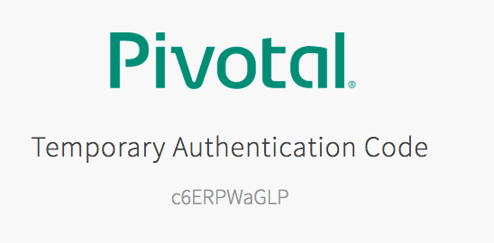
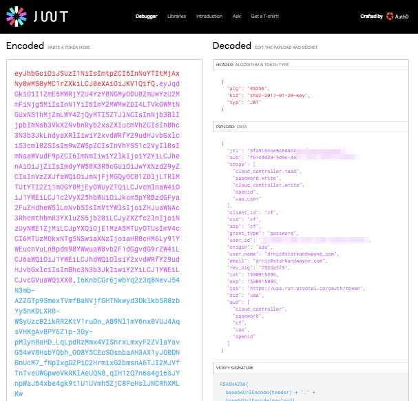
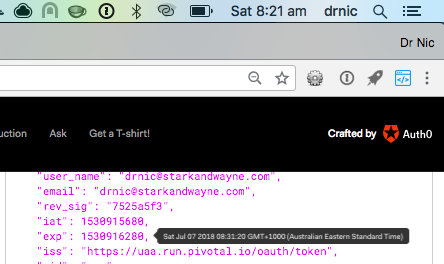

# Real World Examples

## Cloud Foundry CLI

The resource server is the [Cloud Foundry API](https://apidocs.cloudfoundry.org/2.5.0/). The UAA authentication server is typically hosted at both `login` and `uaa` subdomains for historical reasons (they used to be two separate applications).

To view the API calls from the `cf` CLI to the UAA authorization server and the Cloud Foundry API resource server:

```text
export CF_TRACE=1
```

```text
cf login
```

### Passcode

```text
$ cf login -a https://api.run.pivotal.io --sso
API endpoint: https://api.run.pivotal.io

Temporary Authentication Code ( Get one at https://login.run.pivotal.io/passcode )>
```

The UAA presents you with an authentication code:



When you paste it into the terminal the `cf` CLI completes its authentication process.

```text
Temporary Authentication Code ( Get one at https://login.run.pivotal.io/passcode )>
Authenticating...
OK
```

Alternately, you could go directly to the [`/passcode`](https://login.run.pivotal.io/passcode) URL to get the passcode to authenticate to any machine:

```text
cf login -a https://api.run.pivotal.io --sso-passcode c6ERPWaGLP
```

### Client Credentials

```text
cf auth CLIENT_ID CLIENT_SECRET --client-credentials
```

### Generate OAuth Access Token

Once a `cf` user is authenicated - via password grant, auth code/passcode, or with client credentials - they can generate a new access token:

```text
cf oauth-token
```

The output is in the format `bearer <JWT access token>`.

The user can now use the `bearer <JWT access token>` in their API calls with the [Cloud Foundry API](https://apidocs.cloudfoundry.org/) resource server:

```text
cf_auth=$(cf oauth-token)
curl -H "Authorization: ${cf_auth}" https://api.run.pivotal.io/v2/apps
curl -H "Authorization: ${cf_auth}" https://api.run.pivotal.io/v2/domains
```

If we [decode the `<JWT access token>`](https://jwt.io) we can see the UAA scopes that `cf` CLI has been authorized:



Placing the mouse over the `exp` expiry timestamp helpfully shows us when the access token will expire (8:31am). This is 10 minutes after the current time (8:21am).



### Dual Scope

The access token scopes for `cf` CLI are a combination of Cloud Controller API authorizations (`cloud_controller.read`, `cloud_controller.write`) and UAA API authorizations (`openid`, `uaa.user`, `password.write`).

This means we can use the same access token to interact with a subset of the [UAA API](https://docs.cloudfoundry.org/api/uaa).

For example, `openid` allows a user to [look up their own profile](http://docs.cloudfoundry.org/api/uaa/version/4.19.0/index.html#user-info):

```text
curl -H "Authorization: ${cf_auth}" https://login.run.pivotal.io/userinfo
```

My output is:

```json
{
  "user_id": "xxxx",
  "user_name": "drnic@starkandwayne.com",
  "name": "",
  "email": "drnic@starkandwayne.com",
  "email_verified": true,
  "previous_logon_time": 1530852395198,
  "sub": "xxxx"
}
```

Another example is the `password.write` scope which allows a user to [change their password](http://docs.cloudfoundry.org/api/uaa/version/4.19.0/index.html#change-user-password).


The `cf passwd` command prompts the user for new credentials and then invokes the UAA API to attempt to change the password. In my case below, I get an error message from the UAA API:

```text
$ CF_TRACE=1 cf passwd
Current Password>
New Password>
Verify Password>
Changing password...

REQUEST: [2018-07-07T08:37:25+10:00]
PUT /Users/f61c0d28-5d9c-4e15-a26f-f8f42129e2e4/password HTTP/1.1
Host: uaa.run.pivotal.io

RESPONSE: [2018-07-07T08:37:28+10:00]
HTTP/1.1 400 Bad Request

{"error_description":"Password must contain at least 1 special characters.","error":"invalid_password","message":"Password must contain at least 1 special characters."}
```

That was annoying. I had already changed 1password to the new value.

### CLI Discovery of UAA

When a user target's a Cloud Foundry API, the `cf` CLI uses the `/v2/info` endpoint to discover the location of the UAA authorization and token endpoints. For example:

```text
curl https://api.run.pivotal.io/v2/info
```

The relevant portions of the output are:

```json
{
  "authorization_endpoint": "https://login.run.pivotal.io",
  "token_endpoint": "https://uaa.run.pivotal.io",
  ...
}
```

For most Cloud Foundry installations, endpoints such as https://login.run.pivotal.io and https://uaa.run.pivotal.io are [actually the same UAA](https://github.com/cloudfoundry/cf-deployment/blob/fecfb3fd04e5636bdac1e11e14b566b0ca613833/cf-deployment.yml#L477-L486).

### Local Storage of Tokens

As an implementation detail of the `cf` CLI, the user's access and refresh tokens are stored in a local, user-only file `~/.cf/config.json`. Some authorization related portions of the file are:

```json
{
  "AccessToken": "bearer eyJhbGciOiJSUzI1NiIsImtpZCI6InNoYTItMjAxNy0wMS0yMC1rZXkiLCJ0eXAiOiJKV1QifQ.eyJqdGkiOiI0OTYzNzIxYjcxMGI0NzljODA1NmY3NzczMGYyNjZkNyIsInN1YiI6ImY2MWMwZDI4LTVkOWMtNGUxNS1hMjZmLWY4ZjQyMTI5ZTJlNCIsInNjb3BlIjpbIm9wZW5pZCIsInVhYS51c2VyIiwiY2xvdWRfY29udHJvbGxlci5yZWFkIiwicGFzc3dvcmQud3JpdGUiLCJjbG91ZF9jb250cm9sbGVyLndyaXRlIl0sImNsaWVudF9pZCI6ImNmIiwiY2lkIjoiY2YiLCJhenAiOiJjZiIsImdyYW50X3R5cGUiOiJwYXNzd29yZCIsInVzZXJfaWQiOiJmNjFjMGQyOC01ZDljLTRlMTUtYTI2Zi1mOGY0MjEyOWUyZTQiLCJvcmlnaW4iOiJ1YWEiLCJ1c2VyX25hbWUiOiJkcm5pY0BzdGFya2FuZHdheW5lLmNvbSIsImVtYWlsIjoiZHJuaWNAc3RhcmthbmR3YXluZS5jb20iLCJyZXZfc2lnIjoiZDQxYmRjYjEiLCJpYXQiOjE1MzA5MjAzNTYsImV4cCI6MTUzMDkyMDk1NiwiaXNzIjoiaHR0cHM6Ly91YWEucnVuLnBpdm90YWwuaW8vb2F1dGgvdG9rZW4iLCJ6aWQiOiJ1YWEiLCJhdWQiOlsiY2xvdWRfY29udHJvbGxlciIsInBhc3N3b3JkIiwiY2YiLCJ1YWEiLCJvcGVuaWQiXX0.rUBvAqanamiFPpiS9GDJBaJOH0jcHHOseietRNwcTOc2zKxGDxJucrK41gyhG8DAQbVzxSyI8zvbc6RnoLPtCcOlDqMdyCo4kDjKIrfPZoYT3PqxNwe53hRRK7yEDoVU5hRZ9TGrc9sZUT5asjbRn_P60UStc-U-Z-ZORYRew9jlkTX02CMMKAvJyMnFBDibeN84G49q6Ts7VZVnOjXoAXSVUs3xKLcAp24xgAUW25MkBHQY5GGXQLthiT-tWGpHSNoWFAS2_KdcIku4ihgdBQt5sqcIgprcoCF1jdhFm0BPOD5SkHENQ39aaVn2VZvLp-YdpnKlnB64uI9XHF7jVw",
  "AuthorizationEndpoint": "https://login.run.pivotal.io",
  "RefreshToken": "eyJhbGciOiJSUzI1NiIsImtpZCI6InNoYTItMjAxNy0wMS0yMC1rZXkiLCJ0eXAiOiJKV1QifQ.eyJqdGkiOiI4OTIyODgzNmI4Y2Y0YjhjOTJjZmYxMjU2NTMwMjU1Mi1yIiwic3ViIjoiZjYxYzBkMjgtNWQ5Yy00ZTE1LWEyNmYtZjhmNDIxMjllMmU0Iiwic2NvcGUiOlsib3BlbmlkIiwidWFhLnVzZXIiLCJjbG91ZF9jb250cm9sbGVyLnJlYWQiLCJwYXNzd29yZC53cml0ZSIsImNsb3VkX2NvbnRyb2xsZXIud3JpdGUiXSwiaWF0IjoxNTMwOTIwMzU2LCJleHAiOjE1MzE1MjUxNTYsImNpZCI6ImNmIiwiY2xpZW50X2lkIjoiY2YiLCJpc3MiOiJodHRwczovL3VhYS5ydW4ucGl2b3RhbC5pby9vYXV0aC90b2tlbiIsInppZCI6InVhYSIsImdyYW50X3R5cGUiOiJwYXNzd29yZCIsInVzZXJfbmFtZSI6ImRybmljQHN0YXJrYW5kd2F5bmUuY29tIiwib3JpZ2luIjoidWFhIiwidXNlcl9pZCI6ImY2MWMwZDI4LTVkOWMtNGUxNS1hMjZmLWY4ZjQyMTI5ZTJlNCIsInJldl9zaWciOiJkNDFiZGNiMSIsImF1ZCI6WyJjbG91ZF9jb250cm9sbGVyIiwicGFzc3dvcmQiLCJjZiIsInVhYSIsIm9wZW5pZCJdfQ.IiI4NdTU8G3SMcdD-Lo2kRaJeh0j0taFTBmr7KAhAjrtHTnyGpaJZ4DSUZd-4lOHW8Cjh66OeuHF9J8-hRFUw950Qz0GigoK0IflN5GqlSbtL_bFuV5ANjFgBjmNJF-GSa09iD0UDkYjvfsi7X7wCkpAvS6vv6ZmuVLOSRhTNRoEcCeSpk2NTrx8mzx069pLbFZvqOZNaIStLZhG_IX2Lcb-XsAVg5SVogSzoPyhYxghhiI3J-FnA8uPzsH4PxtOpWJ5B6DEL3ygmZ7Zr7EJZLXwIeItIHoGq10RtkeAL08wyPnHOqJNUh5wEveFkV4vPvKxylC8nTIGxqxaoUWX7w",
  "SSHOAuthClient": "ssh-proxy",
  "Target": "https://api.run.pivotal.io",
  "UaaEndpoint": "https://uaa.run.pivotal.io",
  "UAAGrantType": "",
  "UAAOAuthClient": "cf",
  "UAAOAuthClientSecret": ""
}
```

The `cf oauth-token` command will pass the `RefreshToken` to the UAA to request a new `AccessToken`. Indeed, all `cf` subcommands will automatically refresh the `AccessToken` if it has expired.

### UAA Client Definition

The UAA client used by the `cf` CLI is named `cf`, has no secret, and includes long list of requested scopes for access to a user's Cloud Foundry API data. A standard Cloud Foundry deployment will include the following [UAA client configured](https://github.com/cloudfoundry/cf-deployment/blob/master/cf-deployment.yml#L415-L422):

```yaml
cf:
  access-token-validity: 600
  authorities: uaa.none
  authorized-grant-types: password,refresh_token
  override: true
  refresh-token-validity: 2592000
  scope: network.admin,network.write,cloud_controller.read,cloud_controller.write,openid,password.write,cloud_controller.admin,scim.read,scim.write,doppler.firehose,uaa.user,routing.router_groups.read,routing.router_groups.write,cloud_controller.admin_read_only,cloud_controller.global_auditor,perm.admin
  secret: ''
```

### Authentication UX Determined by UAA

The user experience of the `cf` CLI when authenticating users is derived from the UAA. The text `Temporary Authentication Code ( Get one at https://login.run.pivotal.io/passcode )>` originated from the UAA:

```text
curl https://login.run.pivotal.io/info -H 'Accept: application/json' | jq .
```

The output for Pivotal Web Services at the time of writing is:

```json
{
  "app": {
    "version": "4.19.0"
  },
  "showLoginLinks": true,
  "links": {
    "uaa": "https://uaa.run.pivotal.io",
    "passwd": "https://account.run.pivotal.io/forgot-password",
    "login": "https://login.run.pivotal.io",
    "register": "https://account.run.pivotal.io/sign-up"
  },
  "zone_name": "uaa",
  "entityID": "login.run.pivotal.io",
  "commit_id": "7897100",
  "idpDefinitions": {
    "pivotal-oktapreview-com": "https://login.run.pivotal.io/saml/discovery?returnIDParam=idp&entityID=login.run.pivotal.io&idp=pivotal-oktapreview-com&isPassive=true",
    "pivotal-okta-com": "https://login.run.pivotal.io/saml/discovery?returnIDParam=idp&entityID=login.run.pivotal.io&idp=pivotal-okta-com&isPassive=true"
  },
  "prompts": {
    "username": [
      "text",
      "Email"
    ],
    "password": [
      "password",
      "Password"
    ],
    "passcode": [
      "password",
      "Temporary Authentication Code ( Get one at https://login.run.pivotal.io/passcode )"
    ]
  },
  "timestamp": "2018-06-13T12:02:09-0700"
}
```

The `cf` CLI uses the prompts and text from this `/info` output with its own users.

Of very special note is `links.passwd`... the browser URL for me to reset my password.

## BOSH CLI

BOSH is a platform to run systems such as Cloud Foundry, or the UAA, on any cloud infrastructure (AWS, Azure, GCP, vSphere, OpenStack, VirtualBox, Docker, Kubernetes).

The resource server is the [BOSH API](https://bosh.io/docs/director-api-v1/). The BOSH API and UAA are typically colocated on the same VM. The BOSH API is on port `25555` and the UAA is on port `8443` (like our `uaa-deployment up` UAA).

[BOSH API uses UAA claims](https://bosh.io/docs/director-users-uaa-perms/) to limit its own functionality for users/clients.

```text
export BOSH_ENVIRONMENT=10.10.1.4
export BOSH_CA_CERT='...'
export BOSH_CLIENT=admin
export BOSH_CLIENT_SECRET=password
bosh env
```

Even if you are not a BOSH user, you can provision a single VM BOSH API using the a similar approach we've been running our UAA. The `uaa-deployment up` tool originated with a BOSH/UAA version [BUCC](https://github.com/starkandwayne/bucc) by [Stark & Wayne](https://www.starkandwayne.com).

You will need to tear down your local UAA as it uses the same local IP address:

```text
uaa-deployment down
```

To deploy a BOSH/UAA:

```text
git clone https://github.com/starkandwayne/bucc ~/workspace/bucc
source <(~/workspace/bucc/bin/bucc env)
bucc up
```

Once the BOSH/UAA VM has been deployed, we can configure the `bosh` CLI to target the API and authenticate as an `admin` user via environment variables:

```text
source <(~/workspace/bucc/bin/bucc env)
bosh env
```

The output will show that we are the `client 'admin'`, but incorrectly suggests we have logged in as a UAA user `admin`:

```text
Using environment '192.168.50.6' as client 'admin'

Name      bucc
UUID      9fc88b8f-27aa-42b1-9c45-7bf9aba5b242
Version   265.2.0 (00000000)
CPI       warden_cpi
Features  compiled_package_cache: disabled
          config_server: enabled
          dns: disabled
          snapshots: disabled
User      admin
```

It is very common for BOSH operators to begin only using a UAA client `admin` to interact with their BOSH.

Yet, we now know we can create UAA users with appropriate scopes.

### BOSH UAA Users

We can use the `uaa` CLI to create UAA users for BOSH.

The `bucc` CLI includes a helper to authenticate the `uaa` CLI:

```text
$ bucc uaa
Target set to https://192.168.50.6:8443
Access token successfully fetched and added to context.
```

To creata myself a BOSH user:

```text
uaa create-user drnic \
  --email drnic@starkandwayne.com \
  --givenName "Dr Nic" \
  --familyName "Williams" \
  --password drnic_secret
```

To make myself a BOSH admin:

```text
uaa add-member bosh.admin drnic
```

To login with `bosh` CLI as `drnic` user:

```text
unset BOSH_CLIENT
unset BOSH_CLIENT_SECRET
bosh login
```

By providing `drnic` and `drnic_secret` as my username/password, I authenticate and authorized the `bosh` CLI to access the BOSH API on my behalf. The output of `bosh env` shows my user and authorized scopes:

```text
Using environment '192.168.50.6' as user 'drnic' (openid, bosh.admin)

Name      bucc
UUID      9fc88b8f-27aa-42b1-9c45-7bf9aba5b242
Version   265.2.0 (00000000)
CPI       warden_cpi
Features  compiled_package_cache: disabled
          config_server: enabled
          dns: disabled
          snapshots: disabled
User      drnic
```
