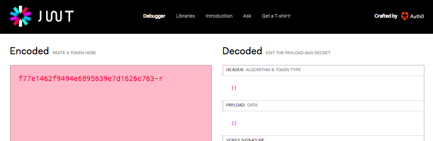
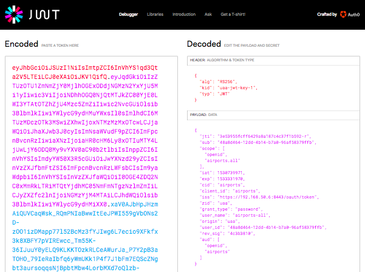

# Refresh Tokens

The UAA offers refresh tokens to allow client applications to routinely check their authority to act on behalf of a user. I think you need to know what they are, when to use them, and why the UAA default configuration is wrong.

## Access Tokens and Refresh Tokens

When a user initially authenticates themselves with a UAA/OAuth2 authentication server we put them through the riggers of proving their identity - they must provide their email and password, maybe a multi-factor authentication/2FA challenge where they must get their phone out of their pocket, and the user may need to explicitly grant authorization to that client application to access some of their personal data. In exchange, the client application receives an stateful access token that it can use for a limited amount of time. The access token is encoded using JWT which allows different client applications to decode it many times to discover who the user is, what scopes the application is permitted to access for the user, and how much longer this access token is valid.

Eventually an access token expires and client applications should stop assuming its contents are valid. The user might no longer wish to authorize that application to access the same scope of their personal data, the user might have revoked authorization to the client applications entirely, or conversely the user themselves might no longer have access to some groups/scopes/permissions. When an access token expires each client application would need each user to login via the UAA/OAuth2 authorization server again. OMG that would be tedious for everyone.

Instead, when a user initially authenticates with the UAA the client applications are provided with both an "access token" for immediate authorization to act on behalf of the user, and a "refresh token" to allow them to ask for new access tokens in future.

When an access token expires - the [default is 12 hours](https://github.com/cloudfoundry/uaa-release/blob/08b170e1f85846a6b85aa56c6104d791977fb17e/jobs/uaa/spec#L593-L595) - a client application should not give up on the user. Instead it should go back to the UAA with the refresh token and ask "please refresh my access token". The UAA will provide the client application with a new access token which will be valid another 12 hours.

A quick summary of the differences between access tokens and refresh tokens:

* Access tokens are passed from client application to backend API/resource server to authenticate and authorize access to data.
* Access tokens have a short life span - a security vs performance trade off between client applications always having to ask the UAA for authorization vs some offline caching of recently granted authorization.
* Client applications should not accept access tokens if they have expired, instead they should require their user to login again they should ask the UAA to refresh their access token.
* Refresh tokens are passed from client applications to the UAA to request a new access token with an longer time til expiry.
* Refresh tokens might never expire, or may have very long expiry times. The [default is 30 days](https://github.com/cloudfoundry/uaa-release/blob/08b170e1f85846a6b85aa56c6104d791977fb17e/jobs/uaa/spec#L596-L598).

## Refresh Token Implementations

The UAA offers two types of refresh tokens - opaque and JWT. As a client application developer, as a UAA operator, or as a security person, you need to know the difference and why I believe the UAA default configuration is currently wrong.

JWT refresh tokens look so much like access tokens, yet they have much longer expiry times, that client applications can be easily tricked into accepting them as access tokens. Sadly, the UAA default configuration is to provide JWT refresh tokens. In the rest of this section we will discuss opaque refresh tokens and JWT refresh tokens, why you should explicitly configure your UAA to only publish opaque refresh tokens, and how to emulate the security flaw in JWT refresh tokens.

## Opaque Refresh Tokens

Opaque refresh tokens look very different from access tokens. They are a short text string that means nothing to anyone outside of the UAA itself. That is, when the UAA publishes an opaque refresh token it stores all the metadata for the refresh token in its database and the refresh token is a reference.

```text
uaa get-password-token airports -s airports -u airports-all -p airports-all
uaa context
```

The output will look similar to:

```json
{
  "access_token": "eyJhbGciOiJSUzI1NiIsImtpZCI6InVhYS1qd3Qta2V5LTEiLCJ0eXAiOiJKV1QifQ.eyJqdGkiOiJjNjQwOWY3MzhhMjc0OTZlYTE3ZjU5NTg1MGNlMjAzMiIsInN1YiI6IjQ4YThkNDY0LTEyZGQtNGIxNC1iN2EwLTk2YWY1ODM3OWZmYiIsInNjb3BlIjpbIm9wZW5pZCIsImFpcnBvcnRzLmFsbCJdLCJjbGllbnRfaWQiOiJhaXJwb3J0cyIsImNpZCI6ImFpcnBvcnRzIiwiYXpwIjoiYWlycG9ydHMiLCJncmFudF90eXBlIjoicGFzc3dvcmQiLCJ1c2VyX2lkIjoiNDhhOGQ0NjQtMTJkZC00YjE0LWI3YTAtOTZhZjU4Mzc5ZmZiIiwib3JpZ2luIjoidWFhIiwidXNlcl9uYW1lIjoiYWlycG9ydHMtYWxsIiwiZW1haWwiOiJhaXJwb3J0cy1hbGxAZXhhbXBsZS5jb20iLCJhdXRoX3RpbWUiOjE1MzA3Mzc3NTUsInJldl9zaWciOiI0YzNiMzgxMCIsImlhdCI6MTUzMDczNzc1NSwiZXhwIjoxNTMwNzgwOTU1LCJpc3MiOiJodHRwczovLzE5Mi4xNjguNTAuNjo4NDQzL29hdXRoL3Rva2VuIiwiemlkIjoidWFhIiwiYXVkIjpbIm9wZW5pZCIsImFpcnBvcnRzIl19.x2R0O5NYlQ3Lg03EwDkX2YFm-ytxAtpz2bONHirdS5nBeC_dES2W50l4DwFdsABSeycSSVSGqh-HW4eFmtuX1xDelENrUid4n6-NHmUjRtjd5mK_ZFL1w1vUfmYJH8icVALuy6IEEeUTFbB7HcL4Xlq6cc6Vd2VujYYfYb4wPBth5eNDIE2xMvAeqzwwF331lyWFZs7fHiK8GX564CStdCiLM48tB-Y30RVZl0vAUORlvvGx4OR-MXtqCyqU00ROA8f7tklHJqRCjMMvuBEw8bqhx-DXlZEJH4BDWMy4baVYH2ghBE-yq-o2rfluwwhoN97KwlYwNYbbZ-wfu7x5vQ",
  "token_type": "bearer",
  "refresh_token": "f77e1462f9494e6895639e7d1626c763-r",
  "expires_in": 43199,
  "scope": "openid airports.all",
  "jti": "c6409f738a27496ea17f595850ce2032"
}
```

We can confirm that the refresh token above is not encoded in JWT format:



That is the "opaque" aspect of opaque refresh tokens - they do not contain any information inside them; only the UAA itself can convert these tokens into the original metadata used to refresh the access token for a user.

It goes without saying that an opaque refresh token could not easily be confused with an access token - by either client applications that receive them from the UAA, nor resource server/backend applications to which they are passed when accessing data. This is a good thing. Refresh tokens and access tokens have a different purpose, and they have vastly different lifespans (hours vs months).

The opaque refresh token is also small. It can be easily stored in the small browser cookies, together with the larger access token.

## JWT refresh tokens

The UAA offers an alternate refresh token - all the metadata for refreshing access tokens is encoded inside the refresh token. The decoded data is JSON and it is in a format that looks very similar to a normal access token. A JWT refresh token, like a JWT access token, is encoded as a JSON Web Token.

As at the time of writing, the UAA publishes JWT refresh tokens that look so identical to JWT access tokens that the UAA will accidentally accept a JWT refresh token in liue of an access token - either by accident of the client application or by malicious misintent by users.

If we re-deploy our UAA to return JWT refresh tokens we can see that they look a lot like access tokens:

```json
{
  "client_id": "airports",
  "grant_type": "password",
  "username": "airports-all",
  "access_token": "eyJhbGciOiJSUzI1NiIsImtpZCI6InVhYS1qd3Qta2V5LTEiLCJ0eXAiOiJKV1QifQ.eyJqdGkiOiJmZTM5MzIzNDY0ZDc0ZmI1YTZmY2I3MWQ4OWY3MjJjNCIsInN1YiI6IjQ4YThkNDY0LTEyZGQtNGIxNC1iN2EwLTk2YWY1ODM3OWZmYiIsInNjb3BlIjpbIm9wZW5pZCIsImFpcnBvcnRzLmFsbCJdLCJjbGllbnRfaWQiOiJhaXJwb3J0cyIsImNpZCI6ImFpcnBvcnRzIiwiYXpwIjoiYWlycG9ydHMiLCJncmFudF90eXBlIjoicGFzc3dvcmQiLCJ1c2VyX2lkIjoiNDhhOGQ0NjQtMTJkZC00YjE0LWI3YTAtOTZhZjU4Mzc5ZmZiIiwib3JpZ2luIjoidWFhIiwidXNlcl9uYW1lIjoiYWlycG9ydHMtYWxsIiwiZW1haWwiOiJhaXJwb3J0cy1hbGxAZXhhbXBsZS5jb20iLCJhdXRoX3RpbWUiOjE1MzA3Mzk5NzAsInJldl9zaWciOiI0YzNiMzgxMCIsImlhdCI6MTUzMDczOTk3MSwiZXhwIjoxNTMwNzgzMTcxLCJpc3MiOiJodHRwczovLzE5Mi4xNjguNTAuNjo4NDQzL29hdXRoL3Rva2VuIiwiemlkIjoidWFhIiwiYXVkIjpbIm9wZW5pZCIsImFpcnBvcnRzIl19.eMjU01Nymsxz_9DZtAKhWAdVzu3KqBwFyuydKIbbqawINkEm0xUXLholF8J4TQBG-V6PwsyG6J5s1p-r8KtiAzcZJMEKdB9naVgTE-KeNaO_DR0eFYkl19oES6vZOTap6SKk9mvP8S5dyt1eR5BcrmGY_O-K8IF0bbjJaU_YiI3oJdizWGXGcUVdEI6YM5IZjD17dQ9r6mWYKRvEQ26WEJw-vTrOyLNRLYupJwnDoUiZDzI2J84vKJCrCThWrTc1x-mSZOV7e9-G2Lh0QLDrnp1R3f4j68Kt31KiK8oV_ANIx_gWXV1EyJKhsR_zmVm7qL9WscTRP0KI3mSgok4LJg",
  "refresh_token": "eyJhbGciOiJSUzI1NiIsImtpZCI6InVhYS1qd3Qta2V5LTEiLCJ0eXAiOiJKV1QifQ.eyJqdGkiOiIzZTUzOTU1ZmNmZjY0MjlhOGExODdjNGMzN2YxYjU5Mi1yIiwic3ViIjoiNDhhOGQ0NjQtMTJkZC00YjE0LWI3YTAtOTZhZjU4Mzc5ZmZiIiwic2NvcGUiOlsib3BlbmlkIiwiYWlycG9ydHMuYWxsIl0sImlhdCI6MTUzMDczOTk3MSwiZXhwIjoxNTMzMzMxOTcwLCJjaWQiOiJhaXJwb3J0cyIsImNsaWVudF9pZCI6ImFpcnBvcnRzIiwiaXNzIjoiaHR0cHM6Ly8xOTIuMTY4LjUwLjY6ODQ0My9vYXV0aC90b2tlbiIsInppZCI6InVhYSIsImdyYW50X3R5cGUiOiJwYXNzd29yZCIsInVzZXJfbmFtZSI6ImFpcnBvcnRzLWFsbCIsIm9yaWdpbiI6InVhYSIsInVzZXJfaWQiOiI0OGE4ZDQ2NC0xMmRkLTRiMTQtYjdhMC05NmFmNTgzNzlmZmIiLCJyZXZfc2lnIjoiNGMzYjM4MTAiLCJhdWQiOlsib3BlbmlkIiwiYWlycG9ydHMiXX0.xaV0AJbHpJHzmAiQUVCaqWsk_RQmPNIaBwwItEeJPWI559gVbONs2D-zOO1izDMapp77l52BcMz3fYJIwg6L7ecio9XFkfx3k8XBFY7pVIREwcc_Tm55K-36IJuuY0yELQ9KLKKTOzkRLCeAWurJa_P7Y2pB3aTOHO_79IeRaIbfq6yWmUKk1P4f7J1bFm7EQScZNgbt3aursoqqsNjBpbtMbw4LorbMXd7oQlzb-7ou6kv9eJyy-Ez6ryKqOBBxTCnYxrlq83AiFWRQ-rxYHcFll-c1OACyMsdfApJq_T0BEp8h_fAZdJ8u-WdsX886JHvDwhX3XToIcN86KvrJGQ",
  "id_token": "",
  "token_type": "bearer",
  "expires_in": 43199,
  "scope": "openid airports.all",
  "jti": "fe39323464d74fb5a6fcb71d89f722c4"
}
```

## Size and Security

A JWT refresh token is large. It turns out that web applications will struggle to store both the JWT access token and JWT refresh token in their cookie-based sessions for each user. This results in web applications needing to do more work to store the access and refresh tokens in a database. One benefit of providing opaque refresh tokens to client applications is their small size.

There is another reason for your UAA to only publish opaque refresh tokens: security.

This refresh token is encoded using JWT, and thus we can decode it and see something very interesting about it:



The decoded `refresh_token` JSON above is:

```json
{
  "jti": "3e53955fcff6429a8a187c4c37f1b592-r",
  "sub": "48a8d464-12dd-4b14-b7a0-96af58379ffb",
  "scope": [
    "openid",
    "airports.all"
  ],
  "iat": 1530739971,
  "exp": 1533331970,
  "cid": "airports",
  "client_id": "airports",
  "iss": "https://192.168.50.6:8443/oauth/token",
  "zid": "uaa",
  "grant_type": "password",
  "user_name": "airports-all",
  "origin": "uaa",
  "user_id": "48a8d464-12dd-4b14-b7a0-96af58379ffb",
  "rev_sig": "4c3b3810",
  "aud": [
    "openid",
    "airports"
  ]
}
```

For comparison, the decoded `access_token` is:

```json
{
  "jti": "fe39323464d74fb5a6fcb71d89f722c4",
  "sub": "48a8d464-12dd-4b14-b7a0-96af58379ffb",
  "scope": [
    "openid",
    "airports.all"
  ],
  "client_id": "airports",
  "cid": "airports",
  "azp": "airports",
  "grant_type": "password",
  "user_id": "48a8d464-12dd-4b14-b7a0-96af58379ffb",
  "origin": "uaa",
  "user_name": "airports-all",
  "email": "airports-all@example.com",
  "auth_time": 1530739970,
  "rev_sig": "4c3b3810",
  "iat": 1530739971,
  "exp": 1530783171,
  "iss": "https://192.168.50.6:8443/oauth/token",
  "zid": "uaa",
  "aud": [
    "openid",
    "airports"
  ]
}
```

What is interesting about these two JSON objects is how similar they look.

How similar are they? I cannot deal with suspense either so let me tell you. The `access_token` contains exactly the same JSON as the `refresh_token` with the addition of some fields:

* `azp`
* `auth_time`
* `email`

But of greater concern is that the `refresh_token` also had a different `exp` (Expiry) field value. It's value was `1533331970` and the `access_token` was `1530783171`. These values are seconds. Subtract them, divide by 60, by 60, and by 24, and you'll see that the `refresh_token` above will expire 29 days after the `access_token`.

That is, the `refresh_token` has a much longer lifespan. The [default configuration of the UAA](https://github.com/cloudfoundry/uaa-release/blob/08b170e1f85846a6b85aa56c6104d791977fb17e/jobs/uaa/spec#L593-L598) is for `refresh_tokens` to expire in 30 days, whereas an `access_tokens` will expire in 12 hours.

If a user revokes access to their private data to a client application, a client application accidentally using the JWT `refresh_token` instead of the JWT `access_token` will continue to have access to those revoked privileges for another 29 days.

If a user has their own access to system privileges changed - for example if they are fired, or change roles - they could continue to have premium access to many systems if they explicitly passed their `refresh_token` to systems in lieu of their `access_token`.

Due to the almost-identical contents of JWT access tokens and JWT refresh tokens, as shown above, it is the responsiblity of all resource servers/backend APIs to ensure they don't accidentally accept a JWT refresh token in lieu of a JWT access token.

We can emulate this problem behaviour against the most unlikely of resource server/backend APIs - the UAA API itself. At the time of writing, the UAA API will accept its own JWT refresh tokens in lieu of its own JWT access tokens.

First, re-deploy your UAA with `jwt` refresh tokens:

```text
mkdir -p operators
cat > operators/8-refresh-tokens-jwt.yml <<-YAML
- type: replace
  path: /instance_groups/name=bosh/jobs/name=uaa/properties/uaa/jwt/refresh?/format
  value: jwt
YAML
uaa-deployment up
```

Once completed, using the `uaa` CLI client, login as our `airports-all` user via the `airports` client.

```text
uaa get-password-token airports -s airports -u airports-all -p airports-all
uaa context
```

The output will show that we have large JWT refresh tokens:

```json
{
  "client_id": "airports",
  "grant_type": "password",
  "username": "airports-all",
  "access_token": "eyJhbGciOiJSUzI1NiIsImtpZCI6InVhYS1qd3Qta2V5LTEiLCJ0eXAiOiJKV1QifQ.eyJqdGkiOiIyYWQxMjdlMTYwODE0NTA1OWNhMjNiMWNkNTA0ZGYyMCIsInN1YiI6IjQ4YThkNDY0LTEyZGQtNGIxNC1iN2EwLTk2YWY1ODM3OWZmYiIsInNjb3BlIjpbIm9wZW5pZCIsImFpcnBvcnRzLmFsbCJdLCJjbGllbnRfaWQiOiJhaXJwb3J0cyIsImNpZCI6ImFpcnBvcnRzIiwiYXpwIjoiYWlycG9ydHMiLCJncmFudF90eXBlIjoicGFzc3dvcmQiLCJ1c2VyX2lkIjoiNDhhOGQ0NjQtMTJkZC00YjE0LWI3YTAtOTZhZjU4Mzc5ZmZiIiwib3JpZ2luIjoidWFhIiwidXNlcl9uYW1lIjoiYWlycG9ydHMtYWxsIiwiZW1haWwiOiJhaXJwb3J0cy1hbGxAZXhhbXBsZS5jb20iLCJhdXRoX3RpbWUiOjE1MzA3NDMyMTIsInJldl9zaWciOiI0YzNiMzgxMCIsImlhdCI6MTUzMDc0MzIxMiwiZXhwIjoxNTMwNzg2NDEyLCJpc3MiOiJodHRwczovLzE5Mi4xNjguNTAuNjo4NDQzL29hdXRoL3Rva2VuIiwiemlkIjoidWFhIiwiYXVkIjpbIm9wZW5pZCIsImFpcnBvcnRzIl19.ceMjhdsA7HSEuKNHk2c0ff22NCq0z1oQg-fyqzAZQxeYu0vC81cvWDQdgWg-FIRZoqBblQIn4GoL8CxbHb5uRmrTK6dCKefYKIlYKc3IOGf7zs07n5JkOqPDO5PEwFkkZujJmaHMhG5YclIwdNYZvcyItrNptP58T8zfTsd7O_pxnSOBMqM1eDi-zDXWxTl5EQ6CFKW2dc0jved1AqEAtTB1TJNWK0hBMV2mUYpip6QoeFhf-hNKp6Dp160nI6mB3D3n7V_7yPSA4oOvUBST-NhozF-U9zlgvf1yOZNO4d2jJfg59FQposlUlSiddJINzJVI0bZwDV4TIlnj4h__jw",
  "refresh_token": "eyJhbGciOiJSUzI1NiIsImtpZCI6InVhYS1qd3Qta2V5LTEiLCJ0eXAiOiJKV1QifQ.eyJqdGkiOiI4NGMzN2UxMTM3NzY0ZDY5YmZiMzA0OGUxZWM3MGE2Yy1yIiwic3ViIjoiNDhhOGQ0NjQtMTJkZC00YjE0LWI3YTAtOTZhZjU4Mzc5ZmZiIiwic2NvcGUiOlsib3BlbmlkIiwiYWlycG9ydHMuYWxsIl0sImlhdCI6MTUzMDc0MzIxMiwiZXhwIjoxNTMzMzM1MjEyLCJjaWQiOiJhaXJwb3J0cyIsImNsaWVudF9pZCI6ImFpcnBvcnRzIiwiaXNzIjoiaHR0cHM6Ly8xOTIuMTY4LjUwLjY6ODQ0My9vYXV0aC90b2tlbiIsInppZCI6InVhYSIsImdyYW50X3R5cGUiOiJwYXNzd29yZCIsInVzZXJfbmFtZSI6ImFpcnBvcnRzLWFsbCIsIm9yaWdpbiI6InVhYSIsInVzZXJfaWQiOiI0OGE4ZDQ2NC0xMmRkLTRiMTQtYjdhMC05NmFmNTgzNzlmZmIiLCJyZXZfc2lnIjoiNGMzYjM4MTAiLCJhdWQiOlsib3BlbmlkIiwiYWlycG9ydHMiXX0.nzGb8Ja6v1yN08iZV8fjLjFwLVBxOISZ_eUZP4cGkeuJB29VpEgtzhipOqeHTH4sDiUhePa8Ktqud23vQSnSgxpQTYpCtgGxizPubzve0qwB8MZHAEyJiua464Ph6A1RG4E4MBlZI9qf15DuRgavnWgRkzvsAueegzhW0SGRqe7g3QO6wKkV0YD42-J_SauYcar53iU-ri6ajD7UyIuT8LrBsjyaLqklxD3unT2FakyAi6kqLW5K84gNUOaSGnl5xI5aQ_m9VXK0-ml_DRImP6c_jMsL5flTTBDsjjrw8o2KfVJPAPKg8cH115WZLh4mEks5irAF91Ky0SqMJKbQ6w",
  "id_token": "",
  "token_type": "bearer",
  "expires_in": 43199,
  "scope": "openid airports.all",
  "jti": "2ad127e1608145059ca23b1cd504df20"
}
```

The `uaa` CLI can use the access token to make API calls against the UAA API (it now becomes the resource server/backend API):

```text
uaa userinfo --verbose
```

The `uaa` CLI stores this user's access token and refresh token in a local file `~/.uaa/config.json`.

Load `~/.uaa/config.json` into your favourite editor and delete the `"access_token":"xxxxx"` value.

We can now confirm that the `uaa` CLI no longer has authorization against the UAA API resource server:

```text
uaa userinfo --verbose
```

The output will show an error:

```text
An access token is required to call https://192.168.50.6:8443/userinfo?scheme=openid
```

Now, let's try using the `refresh_token` as the `access_token` by renaming `refresh_token` in `~/.uaa/config.json` to `access_token` and trying our `uaa userinfo` command again.

This should not work.

```text
uaa userinfo
```

Please don't work.

```json
{
  "user_id": "48a8d464-12dd-4b14-b7a0-96af58379ffb",
  "sub": "48a8d464-12dd-4b14-b7a0-96af58379ffb",
  "user_name": "airports-all",
  "given_name": "Airports",
  "family_name": "All",
  "email": "airports-all@example.com",
  "phone_number": null,
  "previous_logon_time": 1530743185243,
  "name": "Airports All"
}
```

Incredible. The resource server (the UAA API itself in this scenario) blindly accepted a refresh token (with a 30 day lifespan) in liue of a short lived access token.

Please configure your UAA to publish the short, opaque refresh tokens.

## Patch Your Resource Servers to Detect JWT Refresh Tokens

At the time of writing, the UAA cannot be configured to prevent publishing JWT tokens; and there is an API endpoint to allow a mischevious client application to request a JWT refresh token even if you've configured the UAA to publish opaque refresh tokens.

To say that a different way, even if you configure your UAA to only publish opaque refresh tokens there may still be JWT refresh tokens floating about your systems.

Your resource servers/backend APIs could try to detect these bad actors by looking for the signature of a JWT refresh token - it is missing the following fields:

* `azp`
* `auth_time`
* `email`

In addition, you could argue that any access token with a very long expiry time (more than 12 hours) is not a valid access token.

## Restore your local UAA

Before you forget, if you followed along above and created `operators/8-refresh-tokens-jwt.yml` it is now time to delete this and re-deploy your UAA:

```text
rm operators/8-refresh-tokens-jwt.yml
uaa-deployment up
```

## Acknowledgements

My review of refresh tokens in this section was thanks to discussions with Adam Eijdenberg. Adam is currently working for the Australian Govt running their Cloud Foundry platform, and previously worked at Google on OAuth2 for their Google APIs. He has a talk on [YouTube discussing OAuth2 and Google APIs](https://www.youtube.com/watch?v=marDcG1icDg) from a few years back.